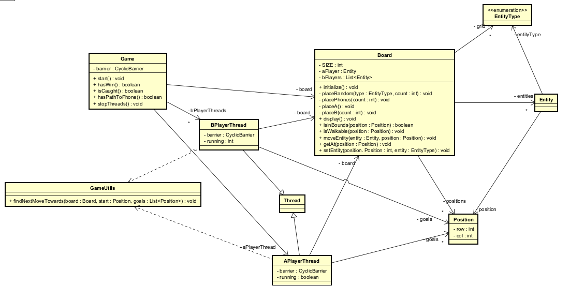

# MatrixConcurrent

**MatrixConcurrent** is a concurrent simulation game written in Java. The game represents a 10x10 matrix-based battlefield where different types of entities interact:

- `#` Obstacles: block the path.
- `T` Phones: goal positions that entity `A` tries to reach.
- `A` Agent: tries to reach a phone (`T`).
- `B` Enemies: try to catch `A` before it reaches the phone.

Each `A` and `B` is controlled by its own **Java thread**, and the game ends when:
- `A` reaches a phone.
- A `B` catches `A`.
- `A` has no path to any phone.

The board updates every 2 seconds in the terminal.

---

## Getting Started

These instructions will help you get a copy of the project running on your local machine for development and testing purposes.

### Prerequisites

You will need the following installed:

- [Java 17+](https://jdk.java.net/)
- [Maven 3.8+](https://maven.apache.org/install.html)
- Git (optional, for cloning)

### Installing

Clone the repository:

```bash
git clone https://github.com/thesrcielos/MatrixConcurrent.git
cd MatrixConcurrent
```

Build the project using Maven:

```bash
mvn clean install
```

---

## Running the Application

You can run the simulation with:

```bash
mvn package
java -cp target/game-app-1.0-SNAPSHOT.jar  org.game.Main
```

The game will initialize the matrix, place the entities randomly, and start the concurrent simulation.

---

## Running the Tests

Run the automated unit tests with Maven:

```bash
mvn test
```

### Unit Tests

Unit tests are written using **JUnit 5** and verify the logic of pathfinding, entity placement, movement rules, and board behavior.

Example:

```java
@Test
public void testDirectPath_NoObstacles() {
    Board board = new Board();
    Position start = new Position(0, 0);
    Position goal = new Position(0, 2);
    board.setEntity(start, EntityType.A);
    board.setEntity(goal, EntityType.PHONE);
    Position next = GameUtils.findNextMoveTowards(board, start, List.of(goal));
    assertEquals(new Position(0, 1), next);
}
```

---

## Coding Style

The code follows the **Google Java Style Guide** and is formatted accordingly.

---

## Deployment

To package:

```bash
mvn package
```

Then run using:

```bash
java -cp target/MatrixConcurrent-1.0-SNAPSHOT.jar org.game.Main
```

---

## Design



---

# Test Report

## Files Tested

- `Board.java`
- `GameUtils.java`
- `Position.java`
- `Entity.java`

## Summary

| Class       | Method                  | Test Description                                  | Result  |
|-------------|--------------------------|---------------------------------------------------|---------|
| GameUtils   | findNextMoveTowards     | Finds optimal path using A*                       | Passed  |
| Board       | initialize, moveEntity  | Places and moves entities correctly               | Passed  |
| Position    | equals, hashCode        | Coordinate-based comparison                       | Passed  |

---

## 📚 Javadoc

Documentation is available in `target/site/apidocs/index.html` after running:

```bash
mvn javadoc:javadoc
```

---

## Built With

* [Java 17](https://www.oracle.com/java/technologies/javase/jdk17-archive-downloads.html)
* [Maven](https://maven.apache.org/) - Dependency Management
* [JUnit 5](https://junit.org/junit5/)

---

## Contributing

Please read **CONTRIBUTING.md** for details on how to contribute.

---

## Authors

* **Diego Armando Macia Diaz** – Initial work

---

## License

This project is licensed under the GNU License – see the LICENSE.md file.
